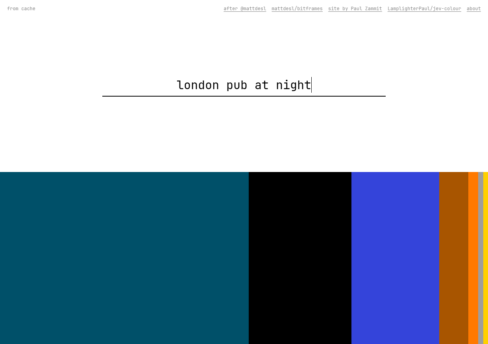

# does Jev understand colour?

Type a word. A small, fast model weighs it against sixteen fixed colours, and the bar is that
weighting drawn to scale — widest first.

Live: **https://jev-colour.zammitpaul.com**



## Where this came from

On 18 September 2026 Matt DesLauriers [posted a demo](https://x.com/mattdesl/status/2100899669802963060)
asking whether Jev understands colour, and in
[a reply](https://x.com/mattdesl/status/2100907712984883362) said how it worked: sixteen predefined
colours, "just rendering their weighted probabilities", pointing at the palette file below. He linked no
source, so this is that sentence written out — a separate implementation, and mine, including anything
about it that is wrong. (He later confirmed the bands in his own version are
["just ordered by probability"](https://x.com/mattdesl/status/2100952454816813450), which is what this
does too.) He has no involvement in this page and has not endorsed it.

The sixteen colours are borrowed, with thanks, from
[`docs/palette.md`](https://github.com/mattdesl/bitframes/blob/main/docs/palette.md) in
[Bitframes](https://bitframes.io) — a 2024 generative-art project of his, MIT licensed. Sixteen colour
values in [`palette.js`](palette.js) are all this takes: the sRGB hex as published, and the same
primaries in Display P3, drawn where the browser allows it. Bitframes itself is an artwork encoded in 32
bytes and has nothing to do with language models.

## A test run

Sixteen football clubs and nations, typed straight into the live page ([`docs/teams.mp4`](docs/teams.mp4)):

| phrase | Jev |
| --- | --- |
| `man utd` | red 100% |
| `liverpool` | red 91%, dark blue 5%, green 2% |
| `juventus` | black 57%, white 27%, gray 7% |
| `borussia dortmund` | yellow 95%, black 3%, orange 1% |
| `barcelona` | dark blue 44%, red 29%, light blue 16% |
| `real madrid` | white 99%, red 1% |
| `inter` | gray 33%, indigo 14%, green 13% |
| `inter milan` | dark blue 72%, black 18%, light blue 5% |
| `inter miami` | hot pink 60%, light pink 18%, dark blue 5% |
| `la galaxy` | dark blue 57%, black 29%, indigo 7% |
| `seattle sounders` | teal 31%, green 27%, dark blue 26% |
| `brazil` | green 89%, yellow 11% |
| `argentina` | light blue 91%, dark blue 4%, white 2% |
| `netherlands` | orange 85%, green 6%, light blue 4% |
| `italy` | green 59%, red 17%, yellow 10% |
| `jamaica` | green 72%, yellow 20%, teal 4% |

`inter` alone is a prefix, not a club, and the answer says so; one more word and it is nerazzurri blue.
`italy` comes back as the flag rather than the azzurri, which is the kind of disagreement the bar is
good at showing.

## How it works

[Jev](https://typesafe.ai) is TypeSafe AI's System One model: it answers typed questions with
probabilities and cannot generate text. The whole page is one question ([`jev.js`](jev.js)):

```js
{
  colour: {
    type: 'choice',
    instructions: 'A person typed a word or phrase. If they had to paint it using only these sixteen
                   colours, which one would they reach for? Judge the phrase as a whole.',
    criteria: { beige: null, black: null, white: null, /* … all sixteen … */ },
  }
}
```

The answer comes back as a probability per colour. That is the picture: no colour maths, no palette
logic, no second model. A band is a colour's probability; the order is the ranking. The only thing code
does to the answer is drop anything below 0.05% and renormalise the rest. Hover a band to see which
colour it is and what it got.

The options are the palette's own names, with one exception: its index 0 is called `background` in the
spec — the beige of the paper — and Jev is shown it as `beige`, because `background` is not a colour a
person would name.

Typical answers, and what they cost (Jev's input tokens at $0.042 per million):

| phrase | Jev | time | cost |
| --- | --- | --- | --- |
| `tomato` | red 100% | 466 ms | $0.000017 |
| `london bus` | red 99%, black 1% | 848 ms | $0.000017 |
| `canada` | red 78%, white 12%, green 6%, light blue 3%, dark blue 1% | 292 ms | $0.000017 |
| `the matrix` | green 59%, black 41% | 356 ms | $0.000017 |
| `stormclouds` | gray 92%, dark blue 5%, black 2%, indigo 1% | 417 ms | $0.000017 |
| `retro` | orange 33%, teal 13%, brown 11%, hot pink 11%, beige 7%, … | 779 ms | $0.000017 |

## Running it

```sh
npm install
TYPESAFE_API_KEY=… npm start   # http://localhost:8080
```

Without a key the server answers with weights derived from a hash of the phrase and says so on the page;
the shape of everything else is the same.

| | |
| --- | --- |
| `GET /api/palette` | the sixteen colours, who is answering, what has been spent today |
| `POST /api/colour` | `{ "phrase": "london bus" }` → the distribution |
| `GET /up` | healthcheck |
| `/?q=london+bus` | a link to an answer |

Identical phrases are answered from memory, each visitor gets forty questions a minute, and the day
stops when `DAILY_USD_CAP` is spent.

## Deploying

[`config/deploy.example.yml`](config/deploy.example.yml) is a [Kamal](https://kamal-deploy.org) config:
copy it to `config/deploy.yml`, put `TYPESAFE_API_KEY` in `.kamal/secrets`, and `kamal deploy`.

## Licence

MIT. The sixteen colour values in `palette.js` are from Bitframes, MIT,
Copyright (c) 2024 Matt DesLauriers; everything else is Copyright (c) 2026 Paul Zammit.
